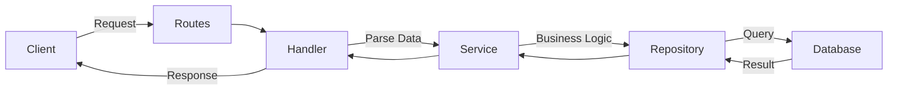

# Hướng Dẫn Luồng Lập Trình Dự Án (Coding Flow)

Tài liệu này hướng dẫn quy trình phát triển một tính năng mới trong dự án **User Management API** để đảm bảo tính nhất quán và tuân thủ các quy tắc của dự án.

## 1. Quy Trình Phát Triển (Standard Flow)

Luồng lập trình được thực hiện từ lớp trong cùng (dữ liệu) ra lớp ngoài cùng (endpoint):

### Bước 1: Model (`internal/models/`)
Định nghĩa cấu trúc dữ liệu chính.
- Sử dụng struct với các tag `gorm` và `json`.
- **Quy tắc:** Không sử dụng kiểu dữ liệu `any`. Luôn định nghĩa rõ ràng các kiểu dữ liệu.
- **Quy tắc:** Nếu có các trạng thái hoặc loại dữ liệu cố định, hãy tạo **Enum** trong `internal/constants` hoặc ngay trong package model (không hard-code).

### Bước 2: Database Migration (`internal/database/migrations/`)
Tạo file migration để cập nhật schema cho database.
- Sử dụng lệnh: `make migrate-create NAME=ghi_ten_migration_o_day`.
- Viết SQL cho cả `up` và `down`.
- Chạy migration: `make migrate-up`.

### Bước 3: Repository (`internal/repository/`)
Thực hiện các thao tác trực tiếp với cơ sở dữ liệu thông qua GORM.
- Repository chỉ nên chứa các logic truy vấn (Query/CRUD).
- Mỗi repository nên đi kèm với một `interface`.

### Bước 4: Service (`internal/services/`)
Nơi xử lý Logic nghiệp vụ (Business Logic).
- Service nhận dữ liệu từ Handler, xử lý logic, và gọi Repository.
- Không để logic nghiệp vụ phức tạp ở Handler hay Repository.

### Bước 5: Handler / Controller (`internal/handler/`)
Xử lý HTTP Request và Response.
- Sử dụng `gin.Context` để parse JSON (`ShouldBindJSON`).
- Gọi Service tương ứng để xử lý dữ liệu.
- Trả về response code phù hợp (200 OK, 201 Created, 400 Bad Request, v.v.).

### Bước 6: Routes (`internal/routes/`)
Đăng ký các route mới vào hệ thống Router của Gin.
- Kết nối URL endpoint với Handler tương ứng.

---

## 2. Quy Tắc Quan Trọng (Core Rules)

1.  **Luôn dùng Tiếng Việt** khi trao đổi và lập kế hoạch.
2.  **Không Hard-code:** Mọi giá trị so sánh hoặc logic trạng thái phải sử dụng **Enum** (hằng số).
3.  **Không dùng `any`:** Định nghĩa Type/Interface rõ ràng cho mọi biến và tham số.
4.  **Cấu trúc Code:** Luôn đi theo trình tự Model -> Repository -> Service -> Handler.

---

## 3. Các Lệnh Makefile Hữu Ích

Dự án sử dụng `Makefile` để quản lý các tác vụ thông dụng với các icon hỗ trợ theo dõi:

- `make start`: 🚀 Khởi động Database (Docker).
- `make stop`: 🛑 Dừng Database.
- `make status`: 📊 Kiểm tra trạng thái Database.
- `make server`: ⚡ Chạy ứng dụng Go API.
- `make migrate-up`: 🔼 Chạy migration để cập nhật DB.
- `make migrate-down`: 🔽 Hoàn tác migration.
- `make clean-port`: 🧹 Giải phóng cổng 8386 nếu bị treo.

---

## 4. Ví dụ luồng hoạt động

